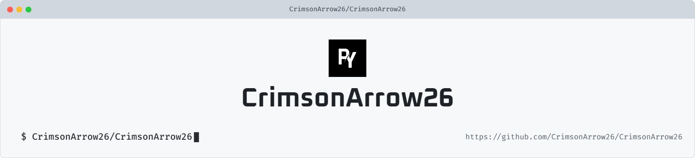

<!-- =========================================================
     🌸 PRATHAMESH YEWALE — GitHub Profile README
     Replace all [PLACEHOLDER] values before publishing.
========================================================= -->

  <!-- 🌗 Responsive Light/Dark Banner -->

  <picture>
    <source media="(prefers-color-scheme: dark)" srcset="art/header-dark.png">
    
  </picture>

   

  <h1>Hey there, I'm PRATHAMESH YEWALE</h1>ALE</h1>

  

    
  

  

    

  

  

    <a href="#-about-me">About Me</a>
    &nbsp;•&nbsp;
    <a href="#-tech-stack">Tech Stack</a>
    &nbsp;•&nbsp;
    <a href="#-github-activity">GitHub Activity</a>
    &nbsp;•&nbsp;
    <a href="#-contribution-snake">Contribution Snake</a>
    &nbsp;•&nbsp;
    <a href="#-connect-with-me">Connect</a>
  

🌸 About Me

<table align="center">
  <tr>
    <td width="65%" align="left" valign="middle">

👨‍💻 A Little About Me

I'm PRATHAMESH YEWALE, an engineer passionate about turning ideas into elegant, practical, and scalable software.

I enjoy working across software development, artificial intelligence, web technologies, cloud platforms, systems, and problem solving. I like understanding how things work under the hood and then building solutions that are useful, reliable, and visually polished.

 

💡 Think → 🧠 Learn → 🛠️ Build → 🧪 Test → 🚀 Ship → 🔁 Improve

🎯 Currently Focused On

Building meaningful software projects

Exploring modern technologies and development workflows

Strengthening problem-solving and engineering fundamentals

Creating clean, maintainable, production-ready solutions

Continuously learning and experimenting with new ideas

 

"Build something useful. Make it beautiful. Keep improving."

</td>

<td width="35%" align="center" valign="middle">

  

</td>

  </tr>
</table>

💻 Tech Stack

<!-- Languages -->

  

<!-- Frontend / Frameworks -->

  

<!-- Backend / APIs / Platforms -->

  

<!-- Dev Tools / Hardware / Data -->

  

<!-- UI / Animation / Design -->

  

<!-- Additional technologies from my stack -->

  
  
  
  
  
  
  
  
  
  
  
  

📊 GitHub Activity

🐍 Contribution Snake

<!--
🐍 The executable GitHub Action is located at:
.github/workflows/snake.yml
-->

<picture>
  <source
    media="(prefers-color-scheme: dark)"
    srcset="https://raw.githubusercontent.com/CrimsonArrow26/CrimsonArrow26/output/github-snake-dark.svg"
  />
  <source
    media="(prefers-color-scheme: light)"
    srcset="https://raw.githubusercontent.com/CrimsonArrow26/CrimsonArrow26/output/github-snake.svg"
  />
  
</picture>

🤝 Connect With Me

✨ Engineering Philosophy

<table>
  <tr>
    <td width="33%" align="center">

🧠 Learn

Stay curious. 
Understand fundamentals. 
Keep experimenting.

</td>

<td width="33%" align="center">

🛠️ Build

Turn ideas into systems. 
Write clean code. 
Solve real problems.

</td>

<td width="33%" align="center">

🚀 Grow

Learn from failures. 
Iterate relentlessly. 
Build better every day.

</td>

  </tr>
</table>

Thanks for visiting my profile!

